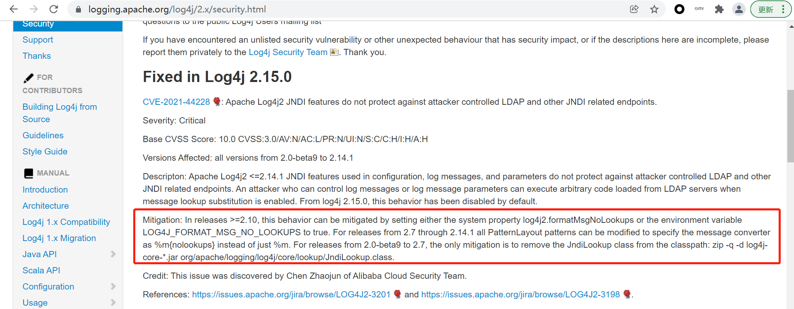

# Apache log4j2 远程命令执行漏洞

## 1. 漏洞信息

漏洞软件： Apache Log4j2

漏洞编号：CVE-2021-44228

漏洞描述：Apache Log4j2 远程命令执行

时间：2021-11-26

漏洞详情：https://cve.mitre.org/cgi-bin/cvename.cgi?name=CVE-2021-44228

漏洞影响范围版本：2.0.beta9 to 2.14.1


## 2. 排查指导

查看引用了 `log4j-api` 和 `log4j-core` 两个jar包，如maven依赖：

```xml
        <dependency>
            <groupId>org.apache.logging.log4j</groupId>
            <artifactId>log4j-api</artifactId>
            <version>2.14.1</version>
        </dependency>
        <dependency>
            <groupId>org.apache.logging.log4j</groupId>
            <artifactId>log4j-core</artifactId>
            <version>2.14.1</version>
        </dependency>
```

## 3. 修复方案

升级到 2.15.0 版本


## 4. 缓解措施

### 2.10 <= 版本 <= 2.14.1

以下方法任选一种：

1. 添加jvm参数：`-Dlog4j2.formatMsgNoLookups=true`
2. 在应用classpath下添加文件`log4j2.component.properties`，添加配置`log4j2.formatMsgNoLookups=true`
3. 添加系统环境变量 `LOG4J_FORMAT_MSG_NO_LOOKUPS=true`


### 2.0-beta9 <= 版本 < 2.10

在classpath中移除JndiLookup 

```shell
zip -q -d log4j-core-*.jar org/apache/logging/log4j/core/lookup/JndiLookup.class
```


参考：




# 参考信息

[1. Apache Log4j2 官网漏洞信息](https://logging.apache.org/log4j/2.x/security.html)

[2. 缓解措施，环境变量名称应该为LOG4J_FORMAT_MSG_NO_LOOKUPS](https://github.com/apache/logging-log4j2/pull/614)

[3. Apache Log4j2 github地址](https://github.com/apache/logging-log4j2)